# Production DevSecOps Platform

A production-oriented DevSecOps platform that demonstrates the complete lifecycle of a containerized, event-driven application running on Amazon EKS.

The project combines Infrastructure as Code, Kubernetes, CI security scanning, passwordless AWS authentication, GitOps delivery, persistent storage, asynchronous processing, monitoring, and automated recovery.

---

## Project Overview

The application is an order-processing platform built from two custom Python services:

* **Orders API** — FastAPI service that receives and stores orders.
* **Orders Worker** — Background consumer that processes queued orders asynchronously.

The platform also includes:

* PostgreSQL for persistent application data.
* RabbitMQ for asynchronous message delivery.
* Redis for caching.
* Amazon EKS for container orchestration.
* Amazon ECR for private Docker image storage.
* GitHub Actions for CI.
* Trivy for vulnerability scanning.
* Argo CD for GitOps continuous delivery.
* Prometheus and Grafana for monitoring.
* Terraform for AWS infrastructure provisioning.

---

## Architecture

```text
Developer
   |
   | git push
   v
GitHub Repository
   |
   v
GitHub Actions
   |
   +--> Build API and Worker images
   |
   +--> Trivy vulnerability scan
   |
   +--> GitHub OIDC authentication
   |
   +--> Push immutable images to Amazon ECR
   |
   v
Git Repository — Desired Kubernetes State
   |
   v
Argo CD
   |
   | Auto Sync / Prune / Self-Heal
   v
Amazon EKS
   |
   +--> Orders API Deployment
   |       |
   |       +--> LoadBalancer Service
   |       +--> PostgreSQL
   |       +--> Redis
   |       +--> RabbitMQ
   |
   +--> Orders Worker Deployment
   |       |
   |       +--> RabbitMQ consumer
   |       +--> PostgreSQL updates
   |
   +--> PostgreSQL StatefulSet
   |       |
   |       +--> EBS gp3 Persistent Volume
   |
   +--> RabbitMQ StatefulSet
   |       |
   |       +--> EBS gp3 Persistent Volume
   |
   +--> Redis Deployment
   |
   +--> Prometheus
   |       |
   |       +--> ServiceMonitor
   |       +--> Kubernetes metrics
   |
   +--> Grafana
```

---

## Core Technologies

| Area                   | Technologies                               |
| ---------------------- | ------------------------------------------ |
| Cloud                  | AWS, Amazon EKS, Amazon ECR, EC2, EBS, ELB |
| Infrastructure as Code | Terraform                                  |
| Containers             | Docker, Docker Compose                     |
| Orchestration          | Kubernetes                                 |
| Application            | Python, FastAPI                            |
| Messaging              | RabbitMQ                                   |
| Database               | PostgreSQL                                 |
| Cache                  | Redis                                      |
| CI                     | GitHub Actions                             |
| Security               | Trivy, IAM, OIDC, IRSA                     |
| GitOps                 | Argo CD                                    |
| Monitoring             | Prometheus, Grafana, ServiceMonitor        |
| Storage                | EBS CSI Driver, gp3, PVC                   |
| Packaging              | Helm, Kustomize                            |

---

## Key Features

### Infrastructure as Code

AWS infrastructure is provisioned through reusable Terraform modules.

The platform includes:

* Custom VPC.
* Two public subnets.
* Two private subnets.
* Multiple Availability Zones.
* Internet Gateway.
* NAT Gateway.
* Public and private route tables.
* Amazon EKS cluster.
* Managed Node Group.
* Amazon ECR repositories.
* IAM roles and policies.
* GitHub Actions OIDC provider.
* EKS OIDC provider.
* EBS CSI Driver IAM role using IRSA.

### Private EKS Worker Nodes

EKS Worker Nodes are deployed inside private subnets.

They do not receive public IP addresses and are not directly reachable from the internet. Outbound access is routed through the NAT Gateway.

This reduces the attack surface while still allowing Nodes to:

* Pull container images.
* Connect to AWS APIs.
* Download required dependencies.
* Communicate with Amazon ECR.

### Multi-AZ Deployment

The infrastructure uses two Availability Zones to provide basic high availability.

Worker Nodes are distributed across separate private subnets, allowing the application to continue running if one Node or Availability Zone becomes unavailable.

---

## Application Architecture

### Orders API

The FastAPI service:

* Receives order requests.
* Stores orders in PostgreSQL.
* Publishes order messages to RabbitMQ.
* Reads and invalidates Redis cache entries.
* Exposes health and readiness endpoints.
* Exposes Prometheus metrics through `/metrics`.

### Orders Worker

The Worker service:

* Consumes messages from the RabbitMQ queue.
* Processes orders asynchronously.
* Updates order status in PostgreSQL.
* Uses message acknowledgements for reliable processing.
* Supports horizontal scaling through multiple replicas.

### RabbitMQ

RabbitMQ separates API request handling from background order processing.

This provides:

* Loose coupling between services.
* Asynchronous processing.
* Reliable message delivery.
* ACK-based message handling.
* Horizontal scaling of consumers.
* Better API response time.

### PostgreSQL

PostgreSQL is deployed as a Kubernetes StatefulSet with persistent EBS storage.

It uses:

* Stable StatefulSet identity.
* PersistentVolumeClaim.
* Encrypted gp3 EBS volume.
* Readiness and liveness probes.
* Kubernetes Secret values for credentials.

### Redis

Redis is used as an application cache.

It runs as a Kubernetes Deployment because cached data can be recreated from PostgreSQL if the Redis Pod is replaced.

---

## CI Pipeline

The GitHub Actions workflow runs on pushes and pull requests targeting `main`.

### Pipeline Flow

```text
Push / Pull Request
        |
        v
Checkout Repository
        |
        v
Build API and Worker Images
        |
        v
Trivy HIGH / CRITICAL Scan
        |
        +--> Vulnerability found: Pipeline fails
        |
        v
Authenticate to AWS with OIDC
        |
        v
Login to Amazon ECR
        |
        v
Tag Images with Git Commit SHA
        |
        v
Push Images to ECR
```

### Matrix Build

The workflow uses a build matrix to process both services:

* `api`
* `worker`

Each image is built, scanned, tagged and published independently.

### Immutable Image Tags

Images are tagged with the Git commit SHA instead of `latest`.

Example:

```text
production-devsecops-platform-dev-api:4847ef2f4d1bbeeb6efbfca9b529291a1f12b165
```

This provides:

* Traceability.
* Reproducible deployments.
* Safe rollbacks.
* Clear mapping between code and image.
* Protection against accidental image replacement.

---

## DevSecOps Security

### Trivy Image Scanning

Every API and Worker image is scanned before it is pushed to ECR.

The pipeline fails when Trivy detects a fixed vulnerability with severity:

* `HIGH`
* `CRITICAL`

During development, Trivy detected three HIGH vulnerabilities in an older Starlette dependency.

The issue was remediated by upgrading FastAPI to a version that installed a patched Starlette release. The pipeline then passed successfully.

This demonstrates a real **Shift Left Security** workflow:

```text
Vulnerability detected before deployment
        |
        v
Pipeline blocked
        |
        v
Dependency upgraded
        |
        v
Image rebuilt and rescanned
        |
        v
Secure image published
```

### GitHub OIDC

GitHub Actions authenticates to AWS using OpenID Connect.

No permanent AWS access keys are stored in the repository.

The workflow requests a temporary GitHub OIDC token, and AWS validates:

* Token audience.
* Repository identity.
* Repository owner ID.
* Repository ID.
* Git reference.
* IAM trust policy.

AWS then issues temporary credentials for the GitHub Actions IAM role.

### IRSA for EBS CSI

The EBS CSI Controller uses IAM Roles for Service Accounts.

A dedicated IAM role is trusted only by:

```text
system:serviceaccount:kube-system:ebs-csi-controller-sa
```

The EBS CSI Controller receives only the permissions required to create and manage EBS volumes.

This avoids giving storage permissions to every application Pod.

### Kubernetes Security Context

The application containers run with restricted security settings:

* Non-root user.
* Numeric UID and GID.
* No privilege escalation.
* Linux capabilities dropped.
* Explicit CPU and memory limits.

### Secret Management

Kubernetes Secrets are not committed to the public repository.

The local `kubernetes/secret.yaml` file is excluded from Git tracking.

For a real production environment, this could be replaced with:

* AWS Secrets Manager.
* External Secrets Operator.
* Sealed Secrets.
* HashiCorp Vault.

---

## GitOps with Argo CD

Argo CD continuously watches the Kubernetes manifests stored in Git.

Git is the source of truth for the desired cluster state.

### Enabled GitOps Capabilities

* Automated synchronization.
* Drift detection.
* Self-healing.
* Resource pruning.
* Retry with exponential backoff.
* Kustomize support.

### Self-Healing Example

The API Deployment is defined in Git with two replicas.

If someone manually runs:

```bash
kubectl scale deployment orders-api \
  --namespace production \
  --replicas=5
```

Argo CD detects that the live cluster no longer matches Git and restores the Deployment to two replicas.

```text
Git: replicas = 2
Cluster: replicas = 5
        |
        v
Argo CD detects drift
        |
        v
Cluster restored to replicas = 2
```

This prevents manual configuration drift and improves deployment consistency.

---

## Persistent Storage

PostgreSQL and RabbitMQ use persistent EBS storage.

### Storage Flow

```text
StatefulSet
   |
   v
PersistentVolumeClaim
   |
   v
gp3 StorageClass
   |
   v
EBS CSI Driver
   |
   v
Encrypted Amazon EBS Volume
```

The StorageClass uses:

* `gp3`
* EBS CSI provisioner.
* Encryption.
* Volume expansion.
* `WaitForFirstConsumer`.
* `ReadWriteOnce`.

`WaitForFirstConsumer` ensures that the EBS volume is created in the same Availability Zone as the selected Worker Node.

---

## Monitoring and Observability

The monitoring stack is deployed using the `kube-prometheus-stack` Helm chart.

It includes:

* Prometheus Operator.
* Prometheus.
* Grafana.
* kube-state-metrics.
* node-exporter.
* Kubernetes dashboards.
* Application ServiceMonitor.

### Application Metrics

The Orders API exposes Prometheus metrics through:

```text
/metrics
```

Custom application metrics include:

```text
http_requests_total
http_request_duration_seconds
orders_created_total
application_errors_total
```

### Service Discovery

A `ServiceMonitor` selects the `orders-api` Kubernetes Service through labels.

Prometheus automatically discovers and scrapes the API without manually configuring Pod IP addresses.

### Example PromQL Queries

Request rate:

```promql
sum(rate(http_requests_total[5m]))
```

Total orders created:

```promql
sum(orders_created_total)
```

95th percentile request latency:

```promql
histogram_quantile(
  0.95,
  sum(rate(http_request_duration_seconds_bucket[5m])) by (le)
)
```

---

## Kubernetes Workloads

The application runs inside the `production` namespace.

| Component     | Kubernetes Resource | Replicas |
| ------------- | ------------------- | -------: |
| Orders API    | Deployment          |        2 |
| Orders Worker | Deployment          |        2 |
| PostgreSQL    | StatefulSet         |        1 |
| RabbitMQ      | StatefulSet         |        1 |
| Redis         | Deployment          |        1 |

### Kubernetes Capabilities

* Rolling updates.
* Health probes.
* Readiness probes.
* Startup probes.
* Resource requests.
* Resource limits.
* Stateful persistent storage.
* Internal Service discovery.
* External LoadBalancer.
* Configuration through ConfigMap.
* Sensitive configuration through Secret.
* Kustomize resource management.

---

## Repository Structure

```text
production-devsecops-platform/
├── .github/
│   └── workflows/
│       └── ci.yml
│
├── apps/
│   ├── api/
│   │   ├── app/
│   │   ├── Dockerfile
│   │   └── requirements.txt
│   │
│   └── worker/
│       ├── app/
│       ├── Dockerfile
│       └── requirements.txt
│
├── argocd/
│   ├── application.yaml
│   └── values.yaml
│
├── infrastructure/
│   └── terraform/
│       ├── environments/
│       │   ├── dev/
│       │   └── prod/
│       │
│       └── modules/
│           ├── ecr/
│           ├── eks/
│           ├── github-oidc/
│           ├── iam/
│           ├── rds/
│           └── vpc/
│
├── kubernetes/
│   ├── api.yaml
│   ├── configmap.yaml
│   ├── kustomization.yaml
│   ├── namespace.yaml
│   ├── postgres.yaml
│   ├── rabbitmq.yaml
│   ├── redis.yaml
│   ├── servicemonitor.yaml
│   ├── storageclass.yaml
│   └── worker.yaml
│
├── monitoring/
│   └── values.yaml
│
├── screenshots/
│   ├── api_images.png
│   ├── EKS_CLUSTER.png
│   ├── IAM_ROLES.png
│   ├── LoadBalancer.png
│   ├── NAT_GATEWAY.png
│   ├── Nodes.png
│   ├── Pods.png
│   ├── Private_repos.png
│   ├── PVC.png
│   ├── Subnets.png
│   ├── SVC.png
│   ├── Upgrade_Insights.png
│   ├── VPC.png
│   └── worker_images.png
│
├── docker-compose.yml
└── README.md
```

---

## Deployment Prerequisites

Required tools:

* AWS CLI
* Terraform
* Docker
* kubectl
* Helm
* Git
* PowerShell or Bash

The AWS account must have permissions to create:

* VPC resources.
* EKS.
* EC2 Worker Nodes.
* ECR repositories.
* IAM roles and policies.
* EBS volumes.
* Load Balancers.

---

## Local Development

Start the local environment:

```bash
docker compose up --build -d
```

Check service status:

```bash
docker compose ps
```

Test the API:

```bash
curl http://localhost:8000/health
```

View API metrics:

```bash
curl http://localhost:8000/metrics
```

Stop the environment:

```bash
docker compose down
```

---

## Terraform Deployment

Move to the development environment:

```bash
cd infrastructure/terraform/environments/dev
```

Initialize Terraform:

```bash
terraform init
```

Format and validate:

```bash
terraform fmt -recursive
terraform validate
```

Review the execution plan:

```bash
terraform plan
```

Provision the infrastructure:

```bash
terraform apply
```

Connect kubectl to EKS:

```bash
aws eks update-kubeconfig \
  --region eu-central-1 \
  --name production-devsecops-platform-dev-eks
```

Check the Nodes:

```bash
kubectl get nodes
```

---

## Kubernetes Deployment

The application is managed through Argo CD, but it can also be validated locally with Kustomize:

```bash
kubectl apply -k kubernetes --dry-run=client
```

Manual deployment:

```bash
kubectl apply -k kubernetes
```

Check resources:

```bash
kubectl get pods -n production
kubectl get services -n production
kubectl get pvc -n production
```

---

## Testing the Application

Retrieve the Load Balancer hostname:

```powershell
$apiHost = kubectl get service orders-api `
  -n production `
  -o jsonpath='{.status.loadBalancer.ingress[0].hostname}'
```

Health check:

```powershell
Invoke-RestMethod "http://$apiHost/health"
```

Readiness check:

```powershell
Invoke-RestMethod "http://$apiHost/ready"
```

Create an order:

```powershell
$body = @{
    customer_name = "Michelle"
    product_name  = "DevSecOps Platform"
    quantity      = 1
} | ConvertTo-Json

Invoke-RestMethod `
  -Method Post `
  -Uri "http://$apiHost/orders" `
  -ContentType "application/json" `
  -Body $body
```

View Worker logs:

```bash
kubectl logs deployment/orders-worker \
  --namespace production \
  --tail=100
```

---

## Accessing Argo CD

Port-forward the Argo CD server:

```bash
kubectl port-forward service/argocd-server \
  --namespace argocd \
  8080:80
```

Open:

```text
http://localhost:8080
```

Retrieve the initial administrator password:

```powershell
$encodedPassword = kubectl get secret argocd-initial-admin-secret `
  -n argocd `
  -o jsonpath="{.data.password}"

[System.Text.Encoding]::UTF8.GetString(
    [System.Convert]::FromBase64String($encodedPassword)
)
```

---

## Accessing Grafana

Port-forward Grafana:

```bash
kubectl port-forward service/monitoring-grafana \
  --namespace monitoring \
  3000:80
```

Open:

```text
http://localhost:3000
```

Default project credentials:

```text
Username: admin
Password: devsecops-admin
```

These credentials are intended only for the temporary development environment.

---

## Troubleshooting Experience

The project included several realistic DevOps and cloud troubleshooting scenarios.

### Dockerfile Parsing Error

The API Dockerfile used an invalid multiline `CMD` format.

Resolution:

* Corrected the JSON array format.
* Rebuilt the image.
* Validated the container startup.

### Python Indentation Failure

The API entered a restart loop because of an invalid `except` block.

Resolution:

* Inspected container logs.
* Located the exact Python line.
* Corrected indentation.
* Rebuilt and verified health endpoints.

### Terraform Recursive Module Cache

The ECR module accidentally referenced itself repeatedly, creating a path such as:

```text
ecr.ecr.ecr.ecr...
```

Resolution:

* Removed the recursive module call.
* Deleted the corrupted `.terraform` module cache.
* Reinitialized Terraform.
* Reconnected the ECR module from the root environment.

### EKS Node Group Failure

The original EC2 instance type was not eligible under the account's Free Tier restrictions.

Resolution:

* Queried Free Tier-compatible instance types.
* Changed the Managed Node Group to `t3.small`.
* Reapplied Terraform.
* Verified all Nodes entered `Ready`.

### GitHub OIDC Authorization Failure

AWS rejected GitHub's OIDC token with:

```text
Not authorized to perform sts:AssumeRoleWithWebIdentity
```

The GitHub repository used immutable OIDC subject claims containing the owner ID and repository ID.

Resolution:

* Retrieved the GitHub owner and repository IDs.
* Updated the IAM trust policy to match the exact immutable `sub`.
* Reapplied Terraform.
* Verified temporary AWS credentials were issued successfully.

### Trivy Security Gate Failure

Trivy found three HIGH Starlette vulnerabilities.

Resolution:

* Identified the vulnerable dependency.
* Upgraded FastAPI.
* Rebuilt the image.
* Confirmed the image passed the security scan.

### EBS CSI Controller Failure

The EBS CSI Controller could not access the EC2 API:

```text
no EC2 IMDS role found
```

Resolution:

* Created an EKS OIDC provider.
* Created an IAM role for the EBS CSI Service Account.
* Attached `AmazonEBSCSIDriverPolicy`.
* Connected the role to the EKS managed add-on using IRSA.
* Recreated the add-on.
* Verified PVCs changed from `Pending` to `Bound`.

### Worker Non-Root Failure

The Worker Pod failed with:

```text
container has runAsNonRoot and image has non-numeric user
```

Resolution:

* Defined a numeric UID and GID in the Pod security context.
* Preserved non-root execution.
* Verified both Worker replicas entered `Running`.

### Monitoring Pod Limit

The Prometheus admission Job could not be scheduled:

```text
Too many pods
```

Resolution:

* Identified the EC2 Pod density limit.
* Increased the Managed Node Group from two to three Nodes.
* Verified monitoring workloads were scheduled successfully.

---

## Screenshots

### Amazon VPC


### Public and Private Subnets

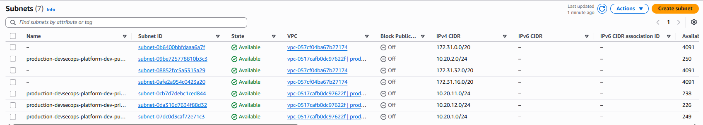

### NAT Gateway

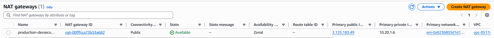

### Amazon EKS Cluster

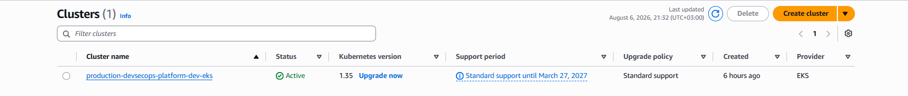

### EKS Upgrade Insights

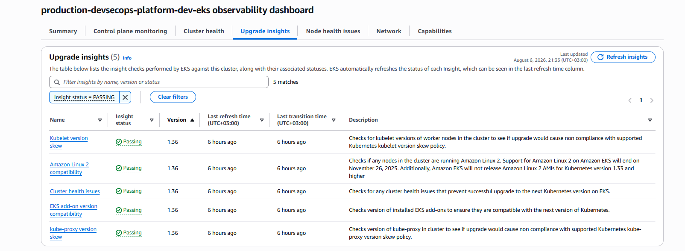

### Worker Nodes

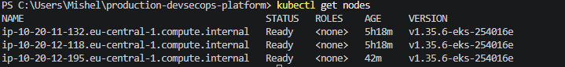

### IAM Roles

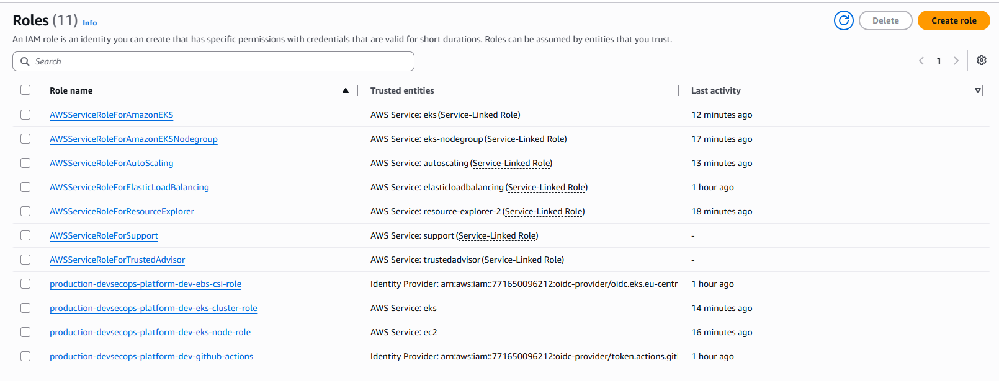

### Private ECR Repositories

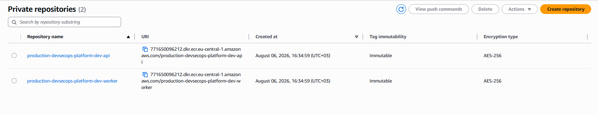

### API Container Images

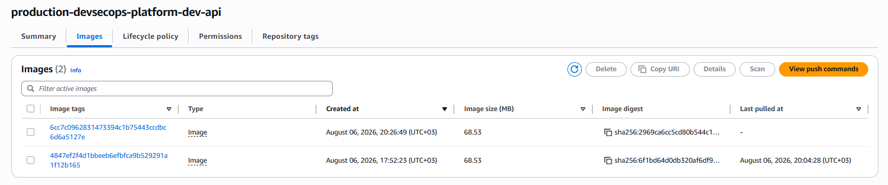

### Worker Container Images

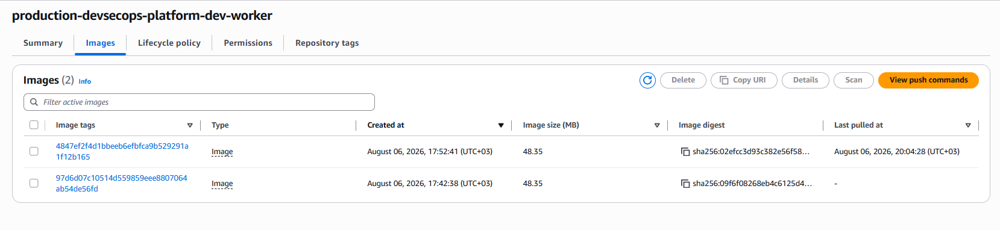

### Kubernetes Pods

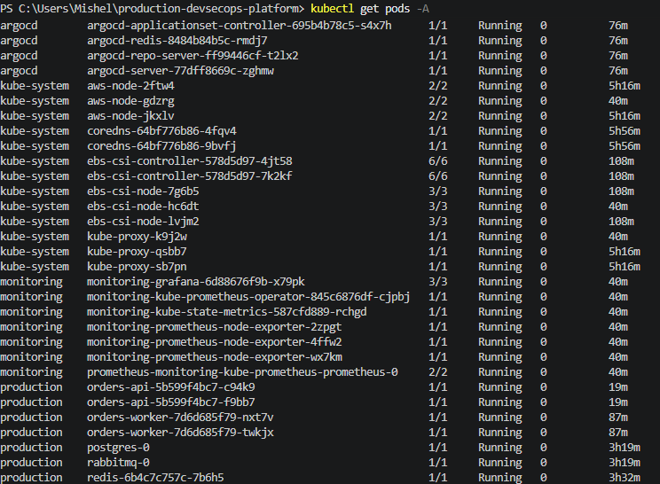

### Kubernetes Services

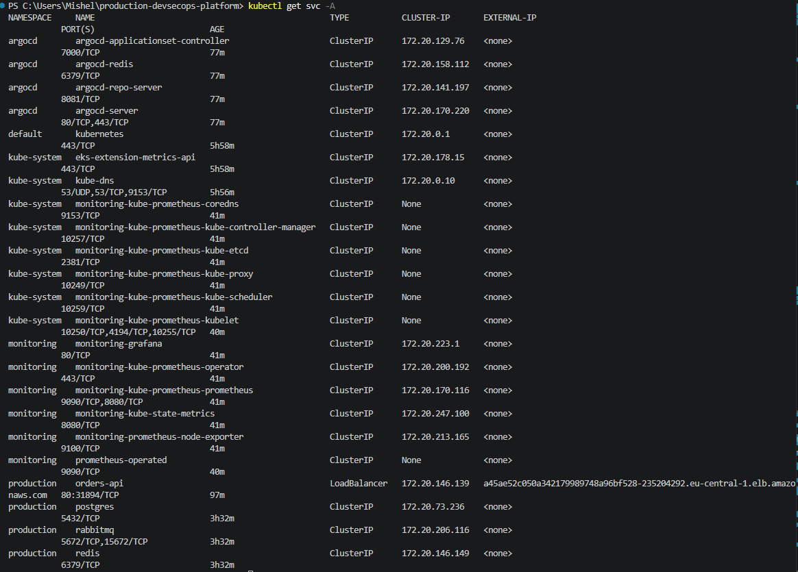

### Persistent Volume Claims

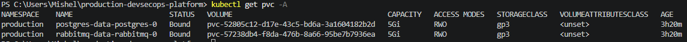

### AWS Load Balancer

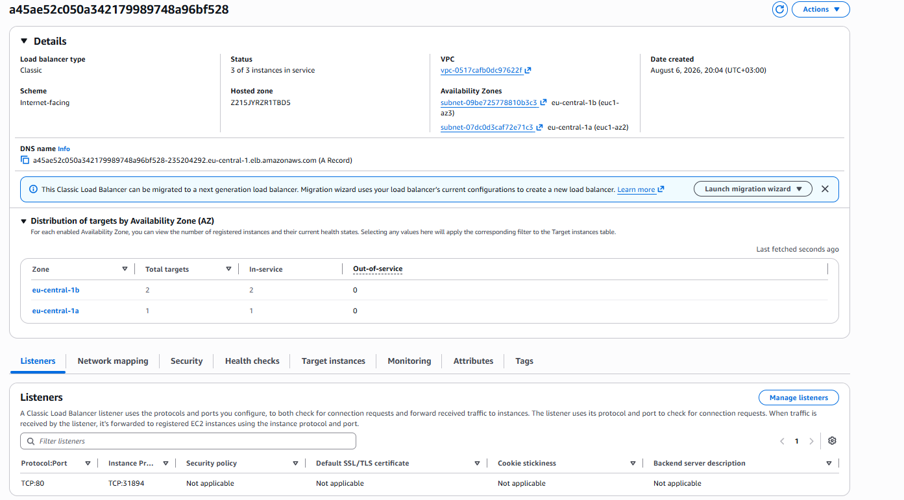

---

## What This Project Demonstrates

This project demonstrates practical experience with:

* Designing AWS network architecture.
* Provisioning modular infrastructure with Terraform.
* Operating Kubernetes workloads on Amazon EKS.
* Building and publishing Docker images.
* Implementing secure CI pipelines.
* Enforcing vulnerability gates.
* Authenticating GitHub to AWS without static credentials.
* Configuring GitOps continuous delivery.
* Running asynchronous message-driven services.
* Managing stateful applications on Kubernetes.
* Provisioning persistent EBS storage.
* Using IRSA for Pod-level AWS permissions.
* Monitoring Kubernetes and application workloads.
* Troubleshooting realistic cloud-native failures.

---

## Future Improvements

Potential production enhancements include:

* Replace in-cluster PostgreSQL with Amazon RDS Multi-AZ.
* Replace in-cluster Redis with Amazon ElastiCache.
* Deploy RabbitMQ as a production cluster or use Amazon MQ.
* Use AWS Secrets Manager with External Secrets Operator.
* Add AWS Load Balancer Controller and HTTPS Ingress.
* Add AWS Certificate Manager certificates.
* Add AWS WAF.
* Restrict the EKS public API endpoint.
* Add NetworkPolicies.
* Add PodDisruptionBudgets.
* Add Horizontal Pod Autoscaling.
* Add Cluster Autoscaler or Karpenter.
* Add Alertmanager notification routing.
* Add centralized logging with Loki.
* Add distributed tracing with OpenTelemetry.
* Add Terraform remote state using S3 and DynamoDB locking.
* Add Checkov and Gitleaks to the CI pipeline.
* Add automated GitOps image tag updates.
* Add staging and production environments.
* Add automated integration and load tests.

---

## Cleanup

The project creates billable AWS resources, including:

* EKS Control Plane.
* EC2 Worker Nodes.
* NAT Gateway.
* Load Balancer.
* EBS volumes.

Destroy the Terraform-managed infrastructure after collecting the required screenshots:

```bash
cd infrastructure/terraform/environments/dev
terraform destroy
```

Type:

```text
yes
```

After destruction, verify that no unexpected resources remain in:

* EKS.
* EC2.
* ECR.
* Elastic Load Balancing.
* EBS.
* VPC.
* IAM.

---

## Author

**Michelle Erlich**

DevOps and Cloud Engineering portfolio project focused on AWS, Kubernetes, Terraform, CI/CD, GitOps, security and observability.
